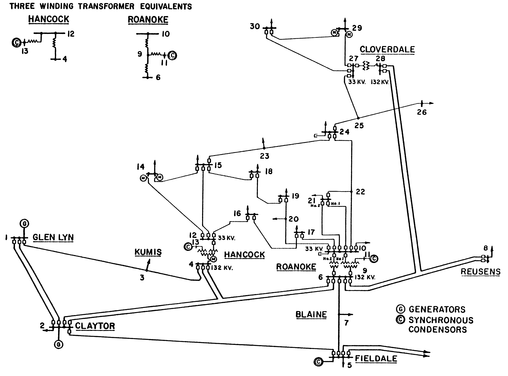

# IEEE 30-Bus System // Sistema IEEE de 30 Nodos

The **IEEE 30-bus** test case represents a simple approximation of the *American Electric Power system* as it was in December 1961. The equivalent system has 15 buses, 2 generators, and 3 synchronous condensers.

The 11 kV and 1.0 kV base voltages are guesses, and may not reflect the actual data. The model actually has these buses at either 132 or 33 kV; what is worth mentioning is that the 30-bus test case does not have line limits [1].

//

El caso de prueba **IEEE de 30 nodos** representa una aproximación simple del *sistema de American Electric Power* tal como estaba en diciembre de 1961. El sistema equivalente consta de 15 buses, 2 generadores y 3 condensadores síncronos.

Las tensiones base de 11 kV y 1.0 kV son estimaciones y es posible que no reflejen los datos reales. De hecho, estos buses tienen tensiones de 132 o 33 kV. Es importante destacar que el caso de prueba de 30 buses no tiene límites en las líneas [1].

___

___

## Archivos de Entrada

### `lines.csv`

Tabla con las siguientes columnas:

| ID  | From | To  | r_pu   | x_pu   | b_pu   | taps  |
| --- | ---  | --- | ---    | ---    | ---    | ---   |
| 1   | 1    | 2   | 0.0192 | 0.0575 | 0.0528 | 0     |
| 2   | 1    | 3   | 0.0452 | 0.1652 | 0.0408 | 0     |
| 3   | 2    | 4   | 0.057  | 0.1737 | 0.0368 | 0     |
| 4   | 3    | 4   | 0.0132 | 0.0379 | 0.0084 | 0     |
| 5   | 2    | 5   | 0.0472 | 0.1983 | 0.0418 | 0     |
| 6   | 2    | 6   | 0.0581 | 0.1763 | 0.0374 | 0     |
| 7   | 4    | 6   | 0.0119 | 0.0414 | 0.009  | 0     |
| 8   | 5    | 7   | 0.046  | 0.116  | 0.0204 | 0     |
| 9   | 6    | 7   | 0.0267 | 0.082  | 0.017  | 0     |
| 10  | 6    | 8   | 0.012  | 0.042  | 0.009  | 0     |
| 11  | 6    | 9   | 0      | 0.208  | 0      | 0.978 |
| 12  | 6    | 10  | 0      | 0.556  | 0      | 0.969 |
| 13  | 9    | 11  | 0      | 0.208  | 0      | 0     |
| 14  | 9    | 10  | 0      | 0.11   | 0      | 0     |
| 15  | 4    | 12  | 0      | 0.256  | 0      | 0.932 |
| 16  | 12   | 13  | 0      | 0.14   | 0      | 0     |
| 17  | 12   | 14  | 0.1231 | 0.2559 | 0      | 0     |
| 18  | 12   | 15  | 0.0662 | 0.1304 | 0      | 0     |
| 19  | 12   | 16  | 0.0945 | 0.1987 | 0      | 0     |
| 20  | 14   | 15  | 0.221  | 0.1997 | 0      | 0     |
| 21  | 16   | 17  | 0.0524 | 0.1923 | 0      | 0     |
| 22  | 15   | 18  | 0.1073 | 0.2185 | 0      | 0     |
| 23  | 18   | 19  | 0.0639 | 0.1292 | 0      | 0     |
| 24  | 19   | 20  | 0.034  | 0.068  | 0      | 0     |
| 25  | 10   | 20  | 0.0936 | 0.209  | 0      | 0     |
| 26  | 10   | 17  | 0.0324 | 0.0845 | 0      | 0     |
| 27  | 10   | 21  | 0.0348 | 0.0749 | 0      | 0     |
| 28  | 10   | 22  | 0.0727 | 0.1499 | 0      | 0     |
| 29  | 21   | 22  | 0.0116 | 0.0236 | 0      | 0     |
| 30  | 15   | 23  | 0.1    | 0.202  | 0      | 0     |
| 31  | 22   | 24  | 0.115  | 0.179  | 0      | 0     |
| 32  | 23   | 24  | 0.132  | 0.27   | 0      | 0     |
| 33  | 24   | 25  | 0.1885 | 0.3292 | 0      | 0     |
| 34  | 25   | 26  | 0.2544 | 0.38   | 0      | 0     |
| 35  | 25   | 27  | 0.1093 | 0.2087 | 0      | 0     |
| 36  | 28   | 27  | 0      | 0.396  | 0      | 0.968 |
| 37  | 27   | 29  | 0.2198 | 0.4153 | 0      | 0     |
| 38  | 27   | 30  | 0.3202 | 0.6027 | 0      | 0     |
| 39  | 29   | 30  | 0.2399 | 0.4533 | 0      | 0     |
| 40  | 8    | 28  | 0.0636 | 0.2    | 0.0428 | 0     |
| 41  | 6    | 28  | 0.0169 | 0.0599 | 0.013  | 0     |

### `nodes.csv`

Tabla con las siguientes columnas:

| Num | Voltage | Angle | Load_MW | Load_MVAr | Generation_MW |
| --- | ------- | ----- | ------- | --------- | -------------- |
| 1   | 1.06    | 0     | 0       | 0         | 260.2          |
| 2   | 1.043   | -5.48 | 21.7    | 12.7      | 40             |
| 3   | 1.021   | -7.96 | 2.4     | 1.2       | 0              |
| 4   | 1.012   | -9.62 | 7.6     | 1.6       | 0              |
| 5   | 1.01    | -14.37| 94.2    | 19        | 0              |
| 6   | 1.01    | -11.34| 0       | 0         | 0              |
| 7   | 1.002   | -13.12| 22.8    | 10.9      | 0              |
| 8   | 1.01    | -12.1 | 30      | 30        | 0              |
| 9   | 1.051   | -14.38| 0       | 0         | 0              |
| 10  | 1.045   | -15.97| 5.8     | 2         | 0              |
| 11  | 1.082   | -14.39| 0       | 0         | 0              |
| 12  | 1.057   | -15.24| 11.2    | 7.5       | 0              |
| 13  | 1.071   | -15.24| 0       | 0         | 0              |
| 14  | 1.042   | -16.13| 6.2     | 1.6       | 0              |
| 15  | 1.038   | -16.22| 8.2     | 2.5       | 0              |
| 16  | 1.045   | -15.83| 3.5     | 1.8       | 0              |
| 17  | 1.04    | -16.14| 9       | 5.8       | 0              |
| 18  | 1.028   | -16.82| 3.2     | 0.9       | 0              |
| 19  | 1.026   | -17   | 9.5     | 3.4       | 0              |
| 20  | 1.03    | -16.8 | 2.2     | 0.7       | 0              |
| 21  | 1.033   | -16.42| 17.5    | 11.2      | 0              |
| 22  | 1.033   | -16.41| 0       | 0         | 0              |
| 23  | 1.027   | -16.61| 3.2     | 1.6       | 0              |
| 24  | 1.021   | -16.78| 8.7     | 6.7       | 0              |
| 25  | 1.017   | -16.35| 0       | 0         | 0              |
| 26  | 1       | -16.77| 3.5     | 2.3       | 0              |
| 27  | 1.023   | -15.82| 0       | 0         | 0              |
| 28  | 1.007   | -11.97| 0       | 0         | 0              |
| 29  | 1.003   | -17.06| 2.4     | 0.9       | 0              |
| 30  | 0.992   | -17.94| 10.6    | 1.9       | 0              |

## Funciones

### `load_data()`

**Descripción (Description):**
Esta función carga datos desde los archivos CSV de entrada y los convierte en DataFrames.

**Entradas (Inputs):**
Ninguna (utiliza los archivos `lines.csv` y `nodes.csv`).

**Salidas (Outputs):**
- `lines`: DataFrame con datos de líneas.
- `nodes`: DataFrame con datos de nodos.
- `num_lines`: Número de líneas.
- `num_nodes`: Número de nodos.

### `create_Ykm()`

**Descripción (Description):**
Esta función calcula la matriz Ykm.

**Entradas (Inputs):**
- `lines`: DataFrame con datos de líneas.

**Salidas (Outputs):**
- `Ykm`: Matriz Ykm.

### `create_P_vector()`

**Descripción (Description):**
Esta función crea el vector P (Potencia Gen - Potencia Dem).

**Entradas (Inputs):**
- `lines`: DataFrame con datos de líneas.
- `nodes`: DataFrame con datos de nodos.

**Salidas (Outputs):**
- `P`: Vector P.

### `DC_power_flow()`

**Descripción (Description):**
Esta función realiza el cálculo del flujo de potencia DC.

**Entradas (Inputs):**
- `Ykm`: Matriz Ykm.
- `P`: Vector P.
- `nlines`: Número de líneas.
- `nnodes`: Número de nodos.
- `lines`: DataFrame con datos de líneas.

**Salidas (Outputs):**
- `dref`: Vector de angulos de las tensiones nodales.
- `pfref`: Vector de flujos de potencia en líneas.

### `Contingency()`

**Descripción (Description):**
Esta función calcula las contingencias N-1 y las ordena según su criticidad.

**Entradas (Inputs):**
- `nlines`: Número de líneas.
- `Ykm`: Matriz Ykm.
- `P`: Vector P.
- `nnodes`: Número de nodos.
- `lines`: DataFrame con datos de líneas.

**Salidas (Outputs):**
- `almacenamiento`: Matriz de flujos de potencia contingentes.
- `almrank`: Matriz de ranking de contingencias.

### `main()`

**Descripción (Description):** Esta función es la función principal que realiza el análisis de flujo de potencia y contingencias en el sistema IEEE de 30 nodos.

**Entradas (Inputs):** Ninguna (utiliza las funciones y datos previamente definidos).

**Salidas (Outputs):** Ninguna (muestra resultados por la consola).
